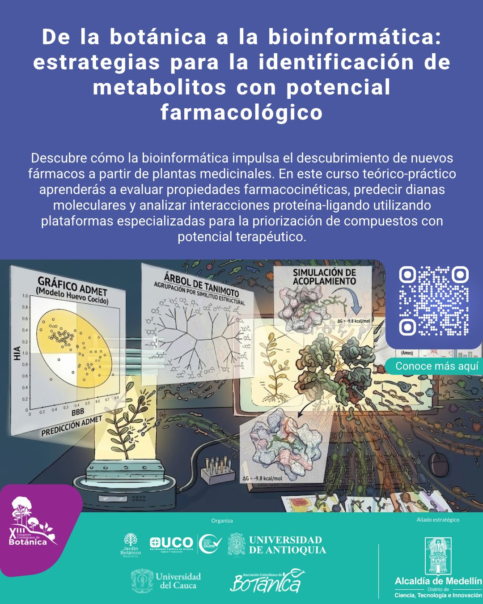

::: {#projects}
:::

::: {style="text-align: justify;"}

**Para más información del curso puede revisar la página [XIII-CCB](https://acb.org.co/xiiiccb2026/) o escribir al [E-Mail](mailto:xgarcia@unicauca.edu.co).**

xgarcia\@nicauca.edu.co {fig-align="center" width="227"}

## Resumen del evento

Durante milenios, la medicina tradicional ha sido preservada por comunidades indígenas, campesinas y afrodescendientes como un sistema de conocimiento para el manejo, diagnóstico, prevención y tratamiento de enfermedades. Este saber constituye un componente clave de los sistemas de salud en diversas regiones del mundo. Según la Organización Mundial de la Salud (OMS), cerca del 80 % de la población mundial recurre a la medicina tradicional, complementaria o ancestral. En este contexto, las regiones neotropicales destacan como hotspots de biodiversidad vegetal. Colombia alberga aproximadamente 26.134 especies de plantas vasculares, de las cuales cerca de 5.000 presentan relevancia medicinal. Esta riqueza etnofarmacológica y fitoquímica ha favorecido la identificación de metabolitos secundarios fundamentales en el descubrimiento de nuevos fármacos con potencial frente a enfermedades cardiovasculares, dermatológicas y neurodegenerativas. En consecuencia, estos enfoques permiten la identificación de compuestos con potencial aplicación en el tratamiento de diversas enfermedades cardiovasculares, dermatológicas y neurodegenerativas. Paralelamente, el avance de la bioinformática ha facilitado el análisis de parámetros clave para el desarrollo de fármacos, como la absorción, distribución, metabolismo, excreción y toxicidad (ADMET), y la predicción de interacciones con dianas moleculares específicas. Este progreso ha impulsado la consolidación de estudios in silico que integran química estructural, física, biología, aprendizaje automático e inteligencia artificial, sustentados además en los principios de las 3R (reemplazo, reducción y refinamiento), promoviendo enfoques más éticos y eficientes. En los últimos años, han transformado el descubrimiento de fármacos al permitir la identificación temprana de compuestos terapéuticos, reduciendo costos y el uso de modelos animales, y facilitando la predicción de toxicidad, afinidad molecular y eficiencia biológica para optimizar la selección de candidatos preclínicos. En ese sentido, el curso propone ejemplificar, a partir de plantas de interés medicinal, la aplicación de estrategias bioinformáticas para la filtración y priorización de metabolitos previamente caracterizados, considerando parámetros farmacocinéticos, farmacodinámicos, ADMET y la afinidad entre ligando y proteína diana. La metodología planteada es de carácter teórico-práctico y se desarrollará en cinco capítulos distribuidos durante dos días. El capítulo 1 abordará la conceptualización histórica del uso de plantas medicinales, así como los aspectos éticos relacionados con la búsqueda de nuevos fármacos. El capítulo 2 se centrará en métodos de extracción, cuantificación y caracterización fitoquímica. El capítulo 3 incluirá fundamentos de biodisponibilidad, farmacodinámica y la interacción de proteína-ligando. Finalmente, el capítulo 4 y 5 estarán orientados a la priorización de metabolitos con potencial terapéutico y al uso de herramientas bioinformáticas como Swiss ADME, Swiss Target Prediction, PASS Online para la evaluación de parámetros ADMET y similitud a fármacos. Asimismo, se emplearán AutoDock y PyMOL para el análisis y visualización de la afinidad proteína-ligando, y R Studio para el procesamiento y análisis de datos.
:::
