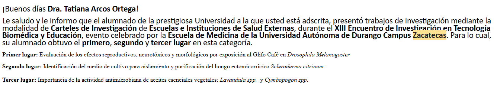

::: {#research}
:::

::: {style="text-align: justify;"}

Este trabajo fue presentado en el marco del XIII Encuentro de Investigación en Ciencias Biomédicas, Habilidades Morfológicas y Educación - Universidad de Durango, Sede Zacatecas, México 

## Resumen

El glifosato representa uno de los herbicidas de mayor uso agrícola global, cuya persistencia en los agroecosistemas colombianos genera creciente preocupación por sus posibles impactos en la salud pública y la biodiversidad. Este estudio evaluó los efectos reproductivos, neurotóxicos y morfológicos de la formulación comercial Glifocafé® utilizando Drosophila melanogaster como organismo modelo no objetivo. Mediante un diseño completamente aleatorizado (DCA), se evaluaron tres concentraciones del herbicida (0,0021; 0,0042 y 0,0104 g/L) frente a un control, empleando 120 individuos distribuidos en réplicas controladas. La metodología integró herramientas in silico (SwissADME, ProTox 3.0 y PASS Online) con bioensayos in vivo que analizaron la densidad y viabilidad en estados inmaduros, el Índice Relativo de Productividad (IRP), el Tiempo Medio de Eclosión (TME), la locomoción por geotaxis negativa y la morfometría pupal. Las predicciones computacionales asociaron el compuesto con rutas de estrés oxidativo y alteraciones neurológicas. Experimentalmente, la concentración de 0,0104 g/L indujo un incremento significativo en el número de pupas y eclosiones, una reducción en la capacidad locomotora (geotaxis) y una disminución drástica en la longitud y diámetro de las pupas. Estos hallazgos demuestran que la exposición a Glifocafé® altera el desarrollo, la reproducción y la morfología en D. melanogaster, aportando datos clave para la evaluación de riesgo ambiental en escenarios agrícolas.

**Palabras clave:** *Drosophila melanogaster, Glifocafé, Glifosato, Neurotoxicidad, Reproducción y Toxicidad subletal*

## Reconocimiento

Este trabajo ganó además un reconocimiento a mejor póster científico.



## Presentación

```{=html}
<iframe src="poster.pdf" width="100%" height="500px" style="border: none;">
    <p>Tu navegador no soporta la visualización de PDFs. 
    Puedes <a href="poster.pdf">hacer clic aquí para descargar el archivo PDF.</a></p>
</iframe>
